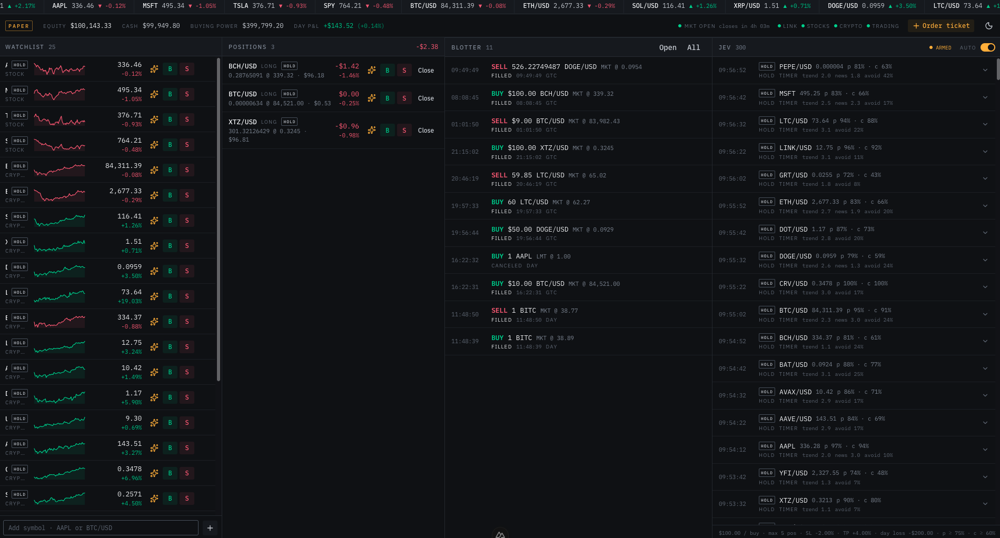

# jev-trade

A self-hosted **paper-trading terminal** for [Alpaca](https://alpaca.markets), with an optional
auto-trading engine driven by **Jev**, TypeSafe's evaluation model, served through
[Vercel AI Gateway](https://vercel.com/ai-gateway).

It streams live stock and crypto prices, shows your paper account, positions and orders on one
screen, and lets you place orders by hand. With a gateway key, Jev evaluates each symbol on your
watchlist every few minutes. Hard-coded risk limits decide whether its verdict turns into an order.



> [!WARNING]
> **Paper trading only. Not financial advice.** Read [Safety](#safety) before running it.

---

## Contents

- [Features](#features)
- [How Jev decides](#how-jev-decides)
- [Quick start](#quick-start)
- [Configuration](#configuration)
- [Architecture](#architecture)
- [HTTP and WebSocket API](#http-and-websocket-api)
- [Project layout](#project-layout)
- [Development](#development)
- [Known limitations](#known-limitations)
- [Safety](#safety)
- [License](#license)

## Features

**Terminal UI** (single page at `/`, dark, monospace numbers)

- **Ticker tape** of watchlist prices with tick-by-tick flashes.
- **Account strip**: equity, buying power, day P&L, market clock, and a status dot for each stream.
- **Watchlist** with sparklines. Symbols are checked against Alpaca before they're added, and the
  list is saved in the browser. The default list has 4 US equities and 21 crypto pairs.
- **Positions** with live P&L and one-click close.
- **Blotter** (order history) with live status updates and cancel.
- **Order ticket** supports market, limit, stop and stop-limit orders, by quantity or by dollar
  amount (market orders only), `day` or `gtc`. The form is validated on both client and server.
- **Jev panel**: an ARMED/off switch, engine status, a manual "Ask Jev" button, and a decision log
  showing each verdict with its probabilities and why it was executed or skipped. Watchlist rows
  also show the latest verdict for their symbol.

**Server**

- A **stream hub** holds one upstream Alpaca connection per stream (stocks, crypto, trade updates)
  and shares it with every browser tab. Subscriptions are reference-counted per symbol.
- REST routes for the account, clock, positions, orders, assets and market-data seeding.
- The **Jev engine** runs on the server as a Nitro plugin and keeps trading when no tab is open.

## How Jev decides

Jev isn't a chat model. It answers **typed questions** about a structured state and returns
probabilities. For each symbol, the engine:

1. **Builds context** in code: returns, SMA, RSI (Wilder), volatility ratio, day range and volume
   from one-minute bars, plus the position, account, market session and recent Alpaca news
   headlines. Every number is also written as a sentence with a qualitative label ("overbought",
   "far above its average"), because the model reads words better than it does arithmetic.
2. **Asks one `experimental_evaluate` call** (AI SDK v7, model `typesafe-ai/jev`):
   | Question   | Type    | Meaning                                                               |
   | ---------- | ------- | --------------------------------------------------------------------- |
   | `action`   | choice  | `buy` / `hold` when flat, `sell` / `hold` when holding                  |
   | `trend`    | score   | Strongly bearish … strongly bullish                                    |
   | `newsTone` | score   | Clearly negative … clearly positive (asked only when there is news)   |
   | `avoid`    | boolean | Is there a concrete reason to stay out of this symbol right now?       |
3. **Applies the policy** (`server/utils/jev/policy.ts`). The risk limits live in code, not in
   the model. The first rule that matches wins:
   - The verdict is `hold`, or the action probability is below **0.75**, or confidence is below
     **0.6**, or `avoid` is **0.7** or higher → skip.
   - Auto is off, or it's a stock and the market is closed → skip.
   - **Buys** also need: no daily loss halt, no cooldown for that symbol, enough bars, no existing
     position, fewer than **5** open positions, and enough buying power. A buy is a **$100**
     notional market order.
   - **Sells** close the whole position. The engine is long-only.
4. **Logs every decision**, executed or skipped, and broadcasts it to open tabs.

**Triggers:** a staggered 5-minute timer per symbol (stocks only while the market is open), a
re-check shortly after each fill, and the manual "Ask Jev" button. The symbols it covers are the
browser's watchlist plus any open positions.

**Risk limits that run without the model:**

- **Stop-loss -2%** and **take-profit +4%** are checked on every price tick for each held position.
- A **daily loss of $200** stops new buys until midnight New York time. Sells, stop-loss and
  take-profit keep running.
- A **15-minute cooldown** per symbol applies to buys only.

Without a gateway key the engine still starts and enforces stop-loss and take-profit. It just
never asks Jev.

## Quick start

**Requirements**

- [Bun](https://bun.sh) (package manager and script runner)
- Node.js 22 (used by the Nuxt and Vitest binaries)
- A free [Alpaca](https://app.alpaca.markets) account with **paper trading** API keys
- Optional: a [Vercel AI Gateway](https://vercel.com/ai-gateway) API key for Jev. The gateway
  needs a credit card on the Vercel team before it will serve requests.

```bash
git clone https://github.com/EliSebastian/jev-trade.git
cd jev-trade
bun install
cp .env.example .env    # then fill in your keys
bun run dev
```

Open <http://localhost:3000>.

> [!IMPORTANT]
> The Jev switch is **ARMED at every boot**. If `NUXT_AI_GATEWAY_API_KEY` is set, the engine
> starts evaluating and placing paper orders on its own. Switch it off in the Jev panel to stop it
> for that session.

## Configuration

All configuration goes through environment variables in `.env` (gitignored). They map to Nuxt
`runtimeConfig`.

| Variable                   | Required | Description                                                  |
| -------------------------- | -------- | ------------------------------------------------------------ |
| `NUXT_ALPACA_KEY_ID`       | yes      | Alpaca **paper** API key ID                                  |
| `NUXT_ALPACA_SECRET_KEY`   | yes      | Alpaca **paper** API secret                                  |
| `NUXT_AI_GATEWAY_API_KEY`  | no       | Vercel AI Gateway key. Without it, Jev never evaluates.       |

**Jev risk limits and thresholds.** Any variable that is missing or not a number falls back to
its default:

| Variable                         | Default   | Meaning                                                   |
| -------------------------------- | --------- | --------------------------------------------------------- |
| `NUXT_JEV_NOTIONAL_USD`          | `100`     | Dollar size of each buy                                   |
| `NUXT_JEV_MAX_POSITIONS`         | `5`       | Max open positions before buys stop                       |
| `NUXT_JEV_COOLDOWN_MS`           | `900000`  | Wait before buying the same symbol again (15 min)          |
| `NUXT_JEV_STOP_LOSS_PCT`         | `-0.02`   | Close a position at -2%                                   |
| `NUXT_JEV_TAKE_PROFIT_PCT`       | `0.04`    | Close a position at +4%                                   |
| `NUXT_JEV_DAILY_LOSS_LIMIT_USD`  | `200`     | Stop buys for the day once day P&L ≤ -$200                 |
| `NUXT_JEV_INTERVAL_MS`           | `300000`  | Evaluation interval per symbol (5 min)                    |
| `NUXT_JEV_MIN_PROBABILITY`       | `0.75`    | Minimum probability of the chosen action                   |
| `NUXT_JEV_MIN_CONFIDENCE`        | `0.6`     | Minimum confidence of the chosen action                    |
| `NUXT_JEV_MAX_AVOID`             | `0.7`     | An `avoid` probability at or above this blocks the trade    |

A few more tunables (`minBars`, `newsMaxAgeMs`, `newsLimit`, `decisionLogCap`) are listed in
[`shared/utils/jev-config.ts`](shared/utils/jev-config.ts).

Engine state (auto switch, watchlist, cooldowns, halt) and the decision log are saved to
`.data/jev/`, so they survive restarts.

## Architecture

```text
 Browser tab(s)                               Nuxt / Nitro server                        Alpaca
┌──────────────────┐   REST /api/*    ┌──────────────────────────────┐   REST    ┌──────────────────┐
│ Nuxt UI page     │ ───────────────▶ │ server/api/*                 │ ────────▶ │ Trading API      │
│  composables     │                  │                              │           │ (paper)          │
│  (useMarketFeed, │   WebSocket /ws  │ Stream hub                   │  streams  │ Market data      │
│   useJev, …)     │ ◀──────────────▶ │  one upstream per stream,    │ ◀───────▶ │ (IEX stocks,     │
└──────────────────┘ ticks, orders,   │  ref-counted symbols         │           │  crypto, orders) │
                     jev frames       │        ▲ peer                │           └──────────────────┘
                                      │ Jev engine (Nitro plugin)    │
                                      │  context → oracle → policy   │  evaluate ┌──────────────────┐
                                      │  → broker → decision log     │ ────────▶ │ Vercel AI Gateway│
                                      │  storage: .data/jev          │           │ typesafe-ai/jev  │
                                      └──────────────────────────────┘           └──────────────────┘
```

- Alpaca keys **never reach the browser**. Every broker call goes through the server.
- The engine connects to the stream hub like a browser tab does, so the Alpaca streams stay
  connected while the server runs, even with no tab open. This is intended.
- The engine depends on small interfaces (broker, market data, news, oracle, storage), which lets
  the tests run it against fakes.

## HTTP and WebSocket API

| Method   | Route                        | Description                                          |
| -------- | ---------------------------- | ---------------------------------------------------- |
| `GET`    | `/api/account`               | Paper account summary                                |
| `GET`    | `/api/clock`                 | Market clock                                         |
| `GET`    | `/api/positions`             | Open positions                                       |
| `DELETE` | `/api/positions/:symbol`     | Close a whole position at market                     |
| `GET`    | `/api/orders?status=`        | Orders (`open`, `closed`, `all`)                     |
| `POST`   | `/api/orders`                | Place an order (validated by `placeOrderSchema`)     |
| `DELETE` | `/api/orders/:id`            | Cancel an order                                      |
| `GET`    | `/api/assets/:symbol`        | Check that a symbol is tradable (404 / 422)          |
| `GET`    | `/api/market/seed`           | Snapshots and bars used to fill in the UI on load     |
| `GET`    | `/api/jev/state`             | Engine state and config                              |
| `PATCH`  | `/api/jev/state`             | `{ "auto": boolean }` turns the switch on or off     |
| `GET`    | `/api/jev/decisions`         | Decision log, newest first (`?symbol=&limit=`)       |
| `POST`   | `/api/jev/evaluate`          | `{ "symbol": "BTC/USD" }` runs Jev on it now          |
| `PUT`    | `/api/jev/watchlist`         | Copies the browser watchlist to the engine            |

**WebSocket `/ws`**

- Client → server: `{ type: "subscribe" | "unsubscribe", symbols: string[] }`, `{ type: "ping" }`
- Server → client: `tick`, `order`, `status`, `error`, `pong`, and `jev` frames
  (`event: "decision" | "state"`)

The exact message types are in [`shared/types/trading.ts`](shared/types/trading.ts) and
[`shared/types/jev.ts`](shared/types/jev.ts).

## Project layout

```text
app/                 Nuxt UI front end
  components/        Panels, rows, ticker tape, order ticket, Jev panel
  composables/       Market feed (WebSocket), account, positions, orders, watchlist, Jev
  pages/index.vue    The one page
server/
  api/               REST routes (Alpaca + Jev)
  routes/ws.ts       WebSocket endpoint → stream hub
  plugins/jev.ts     Starts the Jev engine with the server
  utils/             Alpaca client, stream hub, orders, positions, market data, normalizers
  utils/jev/         indicators → facts → context → oracle → policy → engine, decision log
shared/              Types, zod schemas, symbol helpers and Jev config shared by app and server
tests/               Vitest unit tests (server logic and shared utilities)
```

## Development

| Command            | What it does                          |
| ------------------ | ------------------------------------- |
| `bun run dev`      | Dev server on `http://localhost:3000` |
| `bun run test`     | Run the Vitest suite once             |
| `bun run test:watch` | Vitest in watch mode                |
| `bun run build`    | Production build (`.output/`)         |
| `bun run preview`  | Preview the production build          |

CI (`.github/workflows/ci.yml`) installs with Bun, runs the tests and builds on every push and pull
request.

The engine has to run on a **long-lived Node server**, such as `bun run dev` or the built
`node .output/server/index.mjs`. It won't work on serverless platforms, which have no persistent
process for the timers, WebSocket streams and on-disk state.

## Known limitations

- **No authentication.** Anyone who can reach the server can place orders on your paper account.
- **Paper only.** The Alpaca client is created with `paper: true`. There is no live-trading switch.
- **One instance per API key.** Alpaca's free market-data plan allows one concurrent stream
  connection. Two copies of the app on the same keys will kick each other off.
- **Stocks use the IEX feed** (the free plan), so prices and volume cover only part of the market.
- **No type checking or linting in CI.** `typescript@^7` breaks `vue-tsc`, so `nuxt typecheck`
  can't run yet. The ESLint config refers to packages that aren't installed.
- The `experimental_evaluate` API in the AI SDK is experimental and may change.

## Safety

- This project is for **learning and experimentation**. It is **not financial advice**, and
  nothing here has been checked for trading real money.
- It trades **paper money only**. Don't change it to use live keys.
- The **auto-trade switch is armed at boot**. Check the risk limits in `.env` before starting it
  with a gateway key.
- Run it on `localhost` or a private network. The dev config allows ngrok hostnames for
  convenience. Since there's no auth, anyone with a tunnel URL can use the app.
- Keep `.env` out of version control. It's already gitignored.

## License

[MIT](LICENSE) © 2026 Eli Herrera
